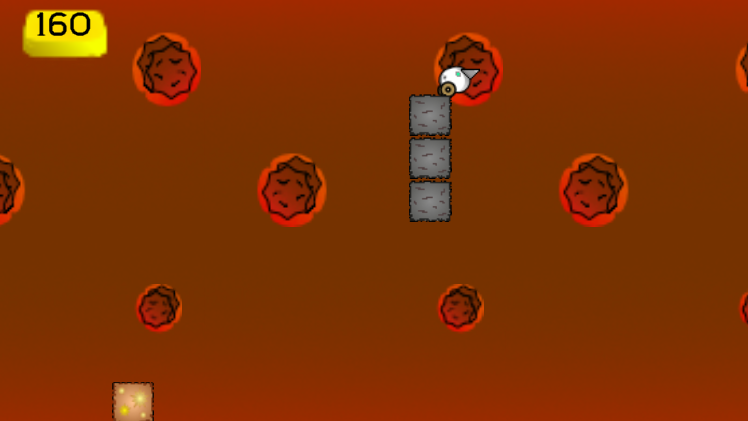

# Ludum Dare 48

Welcome to my entry for this year's Ludume Dare title, **Sky Plummet**!

> This was submitted as part of the Compo entry, meaning that ALL assets, except for one font, were developed by myself, so keep this in mind when playing!

## Objective

The goal of **Sky Plummet** is to get the high score by drilling you way into gold ore blocks! And avoid slamming headfirst into anything! 

## Controls

- `A` and `D` _or_ `Left` and `Right` arrows: Move horizontally
- `Spacebar`: Start / Stop Plummet

## Features
- Endless gameplay, where high scores are saved in a play session!
- Dynamic difficulty; the longer you plummet and get points, the harder the game will become.
- Played and tested on Windows and WebGL!
- Dynamically changing backgrounds the further you drop!

## Screenshots

## Tools Used

- Unity 2020 (engine)
- Visual Studio 2019 (Coding/Engine)
- Affinity Photo (Art)
- Piskel (Art)
- Boscoa Ceoil (Music)
- sfxr (SFX)

## Future List

- Clean up code! (It makes me sad hahaha!!!)
- Add cut content to bounce off of specific blocks
- Add more variety to spawner

## Credits

- Programming = maishiroma (Kaabiikaze)
- Art = (Kaabiikaze)
- Game Design = (Kaabiikaze)
- UI = (Kaabiikaze)
- Music / SFX = (Kaabiikaze)
- Font = Jaggy Keen (by DeddyAng)
